# 基于计算机视觉的排污行为监测、污水色度检测及基于Django框架的智慧河网在线可视化监测平台

## 研究背景

### 排污口检测研究背景

图像处理是利用计算机对图像进行分析以获得所需结果的技术。图像处理技术主要包括三个部分的内容：图像压缩，图像增强和复原，图像匹配、描述和识别。目前，图像处理技术在摄影及印刷、卫星图像处理、无人驾驶、人脸识别等多个领域中得到了广泛应用，而且表现出色。随着技术的不断发展成熟，软硬件成本大大降低，这为图像处理技术的应用带来了新的机遇，其中之一就是在环境监测和保护领域方面的应用。

经济的高速发展，丰富了我们的物质生活，但同时也带来环境污染问题，水污染便是其中较为突出的现实问题。很多工业生产和制造都会产生大量的污水，这些污水若未经处理就直接排入河流或农田中，会造成地表和地下水质污染，导致生态环境恶化，进而给我们的健康带来严重威胁。下图呈现的就是污水排放造成溪流污染的一个实际例子。毫无疑问，我们需要采取多方面的措施来解决日益严峻的水环境污染问题，其中之一就是要对污染源头的污水排放情况进行有效的监测，亦即，进行快速、准确的水质污染检测。

在水质污染的检测中，色度是一项重要的检测指标。色度检测的传统方法主要有目视比色法和分光光度法。目视比色法是检测者通过眼睛观察和比较溶液颜色的深浅以测定物质含量的方法。这种方法虽然简单，但是容易出现主观判断带来检测偏差，而且需要花费较高的人工成本。鉴于目视比色法存在的不足，研究者们提出利用分光光度法代替目视比色法进行色度的检测，并用于污水色度检测。然而，与目视比色法一样，分光光度法仍然是一种人工方法，无法实现自动检测，属于事后检测、存在时间滞后的明显不足。

近年来，为了提高水质检测的效率，人们对一些新技术进行了研发和运用，其中比较有代表性的是物联网技术和无人机技术。应用物联网技术，可对水环境的污染和治理情况进行监测，实现远程监控管理；利用无人机技术，可对目标水域进行监控，通过采集、传输监控图像到地面测控中心再进行分析，极大提高了水质样本的采集效率和应急环境的监测能力。然而，这两种监测方式，仍然离不开人工的采集、检测和分析，如此才能获得相应的监测结果。注意到，随着视频监控等技术的成熟和硬件设备的成本降低，视频监控设备得到广泛的应用。因此，若能通过视频监控手段直接获取图像，并且对图像进行及时自动处理、分析得出判断结果，这将有助于提高水质检测的效率，为防止水质受到大范围的污染提供有效的监控手段。

目前，已有若干工作对图像处理和识别技术在水质检测中的应用进行了初步的研究和探索。例如，针对水质检测中的浊度检测（与色度一样，浊度也是水质检测的一个重要指标），有研究者提出了一套基于图像识别技术的水质浊度检测系统。试验测试结果表明，该系统的浊度测量的平均误差率约为0.5%，而最大误差率低于5%，验证了基于图像识别技术的水质浊度检测的可行性。此外，张良均等应用图像处理技术对水色图像进行处理，实现了对水质的自动评价，并且通过实验验证了方法的可行性。这些相关工作表明，运用图像处理和识别技术进行水质检测，不仅能避免人工评价水质造成的误差，而且能降低检测成本、提高工作效率。然而，这些工作还没有彻底解决水质检测问题，尤其是如何运用图像处理和识别技术对色度进行有效检测，仍值得探索和研究。

本项目中我们研究如何利用图像处理和识别技术对排水管的排污行为进行有效的检测。首先，结合基于Cascade级联分类器的目标检测算法对是否存在管道进行检测。随后，基于二分类的方法检测管道口目标是否在排水。最后，对排水中的管道进行进一步检测，以期进一步分析管道是否在排污水。基于卷积神经网络的色度定量检测方法，不仅能够提高工作效率、降低成本，而且实现了检测技术的智能化，该方法在现有的排污行为检测方法中是一种新的检测方法，是具有一定研究意义的。

### 目标检测主流方法

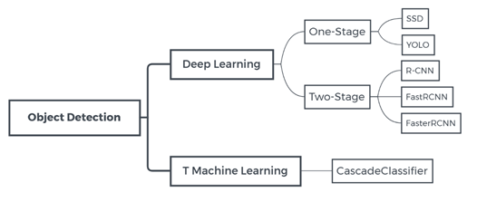

目标检测技术经过长时间发展，主要形成了以Cascade为代表的传统机器学习方法，以及后来兴起的深度学习方法。其中，深度学习方法又包括了One-Stage和Two-Stage两个分支，其中诸如YOLO，FasterRCNN技术在精度和速度上都表现突出，引起了学术界工业界的关注。

## 各部分文件功能介绍

### Introduction

```python
-CVShowOnline	#在线污水监测平台demo源码
-DataSetBuildAndEnhance	#数据集建立及增强
-objectDetectionClassifier	#检测算法
-train			#训练程序
-TrainDataset.zip			#训练用样本数据集
```

### About objectDetectionClassifier

```python
-database	#存放检测截图结果
-result	#存放最终结果，含检测框和文字标注，可直接展示
-objectDetectionClassifier.py	#代码文件
-path.txt	#路径读取文件夹:取待处理图片文件夹的绝对路径，复制进去即可。
			#待处理图片统一为jpg格式，但命名无需处理可以混乱，不必1，2，3....
-cascade.xml	#第一阶段检测模型
-model_yes_or_not	#第二阶段，有无污水分类模型
-model_clean_or_dirty	#第三阶段，清水污水分类模型
```

## 研究思路

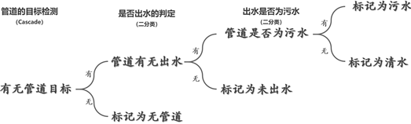

本研究基于类似于面向对象设计中的封装的思想，将识别过程分为三个部分——管道目标的检测、是否出水的二分类判定、污水及清水的二分类判定。三部分相互独立，有利于本项目更好的维护。

在检测过程中，首先针对管道口进行目标检测，在检测到管道口后，进一步检测管道口的出水情况，在管道口检测到出水后，进一步检测其是否为污水并进行对应的标记。

## 数据准备


基于前已述及的判定树，我们分别如上图所示的思路设计了相应的数据集及检测集。由于网络公开数据有限，因此我们在互联网上搜索的基础上，进行了一部分场景下的实拍，并逐帧截取视频图像，得到了较为丰富的数据集，以期能提升训练效果的鲁棒性。为了进一步提升训练结果的鲁棒性，我们对数据进行了一定程度的增强。经过素材收集及数据增强后，我们得到了数千张图片数据形成的数据集。训练结果表明，场景较为丰富、经过有效增强的数据集具有更好的性能。

在训练模型时，应当首先截取出原数据集中的目标，并将其进行灰度化处理。在此基础上，可利用必要的数据增强手段得到经过增强后的数据。此处数据集增强算法伪代码描述如下：

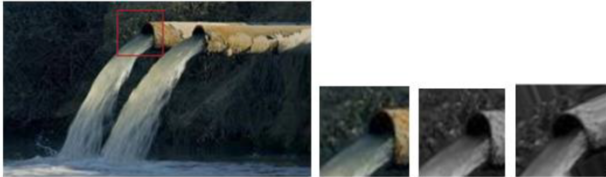

```python
seq = iaa.Sequential(
[
        对20%的图像进行镜像翻转
        对20%的图像做左右翻转
        对随机的一部分图像做幅度为0到10%的剪切操作
        对部分图像缩放、平移、旋转、剪切、填充等仿射变换
        随机使用下面的方法去增强图像
            [
                 将部分图像进行超像素的表示
                 用高斯模糊，均值模糊，中值模糊中的一种增强
                 锐化处理
                 加入高斯噪声
                 扭曲图像的局部区域
            ],
         随机的顺序把这些操作用在图像上
        )
    ],
        随机的顺序把这些操作用在图像上
)
```

特别的，对于清水与污水的二分类问题，我们采用了锐化、亮度、色度、对比度等调节，以期在不影响画面整体颜色和水流浑浊程度的情况下实现更好的数据增强。对于此场景下的数据增强，一组可供参考的原图及增强后结果如下：

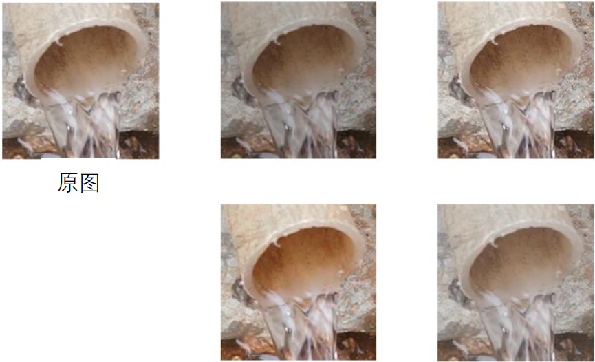

样本数据的均衡性对于训练结果有着重要影响，下图展示了我们样本分布情况。由于难以收集到大量清水样本，因而Stage3样本均衡性相对较差。这也是最终Stage3训练效果欠佳的一个可能原因。从图中看，其余样本分布整体较为均衡。

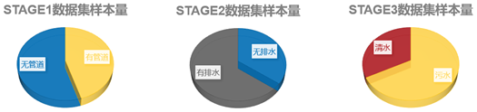

## 研究方法

### 级联分类器

#### 原理概述

级联分类器，也称Cascade Classifier，是一种较为传统的基于机器学习的目标检测方法。

其于2001年被首次提出，并在多种任务上取得了不错的效果。固然现在基于深度学习的方法，如YOLO，FastRCNN等是主流，但Cascade也有其独到的特点和优势。

首先，Cascade以较小的数据量就可以在不那么复杂的场景下，取得较为鲁棒的效果。由于本次项目不提供数据集，在数据集不很充足的情况下，这一点无疑是适配的。其次，排污检测面对的目标往往是一个目标（管口）或一组目标（相邻2-3个管口），对于这种单区域、单目标的检测，确实不必一味动用深度学习方法。此外，Cascade的训练速度很快。

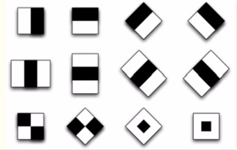

如图所示，为一些Haar特征，它们可以采用类似卷积的原理，提取目标对应的特征。这样多个弱分类器串联集成起来，便起到了强分类器的效果，这也是Cascade的本质原理。

#### 实现

我们基于Python OpenCV实现Cascade分类器，完成目标检测任务。在数据集准备方面，我们需要提供正负样本，其中正样本数量为508，负样本数量为816。在超参数设置方面，模型级数为20，特征类型为LBP特征，其可以在达到与Haar特征近似精度的情况下，保证较快的运算速度。附训练截图如图所示。

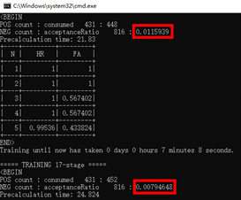

### 迁移学习

#### 原理概述

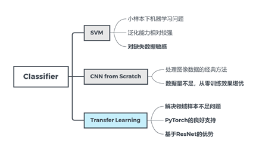

在分类任务方面，我们最终选择了迁移学习。迁移学习（Transfer Learning）对于人类来说，就是掌握举一反三的学习能力。比如我们学会骑自行车后，学骑摩托车就很简单了；在学会打羽毛球之后，再学打网球也就没那么难了。对于计算机而言，所谓迁移学习，就是能让现有的模型算法稍加调整即可应用于一个新的领域和功能的一项技术。

鉴于PyTorch已经预训练好了ResNet供我们使用，这极大减轻了我们时间和运算成本的压力。其基于ImageNet这个包罗万象的数据集进行训练，我们可以猜想其习得了生活中诸多细节与特征，至少不会对我们的任务造成负迁移的不良影响。故我们确定了迁移学习的方案。

#### 实现

我们基于PyTorch实现迁移学习，其主要算法流程图如图4.4所示。训练完毕后，我们保存模型，以便之后加载并测试。

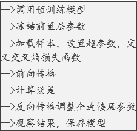

一些超参数的设置为Train : Test --> 7 : 3，Adam Optimizer,，learning rate = 0.0001，epochs = 30，batch size = 32

## 结果分析

### 评价指标（准确率）

对于二分类任务，我们以准确率作为评价迁移学习效果的主要指标。如图所示，左图为阶段二（是否排水）任务分类准确率，我们可以看出其具有较高的准确率，均值在99%，最低也为95%，分类效果较好。右图为阶段三（清水还是污水）任务分类准确率，我们可以看出其准确率相对低一些，均值76%，最大值约83%。我们考虑一方面由于清水数据难以搜集造成了样本不均衡，另一方面网络并没有很好学习到清水污水本质区别，可能需要进一步纹理、颜色仔细的分析

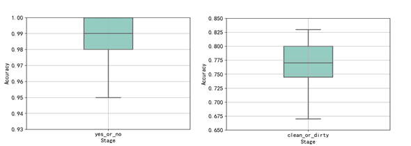

### 典型检测结果

如下图所示，模型对于**不同角度、不同颜色水质均能较好的识别，也即对于污水的检测效果较好。**

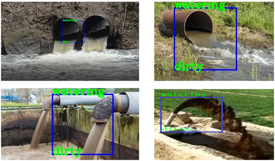

在大多数理想情境下，我们的模型能很好的识别清澈的水流，但对于较为复杂的环境，我们的模型不总是能正确的工作。这可能是由于样本集均衡性不足导致的。相应的识别也因此有待于进一步优化和改进

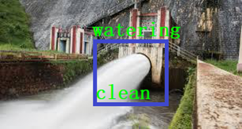

对于道不出水的场景，我们的模型在大多数理想环境下也能很好的工作

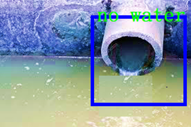

对于没有管道的场景，我们的模型也能在大多数情境下正确的工作，给出正确的运行结果。

总体来看，我们的模型运行良好，鲁棒性较好，但在部分特定场景下的识别效果还有进一步优化空间，未来可以进一步改进与优化

## 可视化河网监测平台

为了更好的展示我们的项目成果，以及更接近实际情况的去完成这个项目，我们考虑真实项目环境中可能遇到的问题，即面向服务对象提供简单易用且直观的系统，我们搭建了这个可视化系统平台，可用于大屏智慧，日常监控等。平台通过Django框架搭建，读者可自行实现服务器端的部署。

> 我们假想的服务对象为某城市A的政府或者该城市的水利部门。项目需求为接入该城市的工业污水排放点监控视频，或者定点巡航无人机的回传视频，实时监控和分析，提醒是否有违规排放污水的污水排放点，及时提醒并且显示排污点位置，方便相关工作人员快速反应，对违规排水企业进行劝阻或处罚等

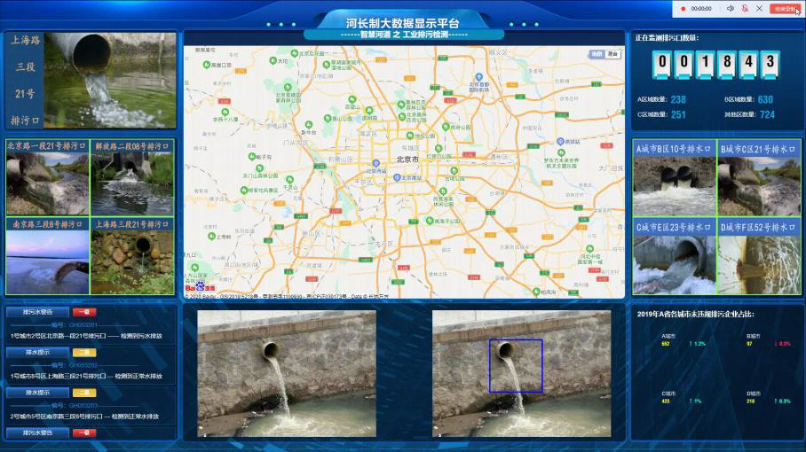
